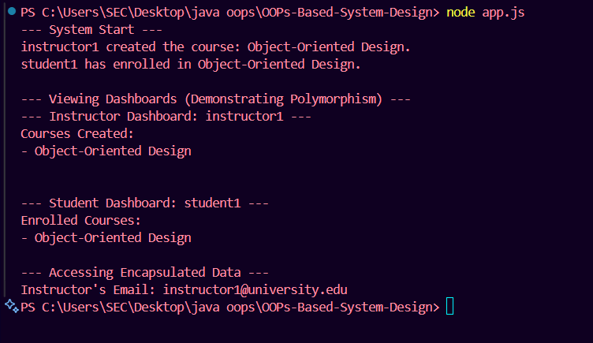

# OOPs-Based-System-Design
# E1 - OOP-Based System Design – Mini Interview Task
## Objective:
Simulate a system design interview by applying core OOP concepts to design and implement an object-oriented model for a real-world use case.

## Scenario:
You have been asked to design an Online Course Management System using Object-Oriented Programming (OOP) principles.

This system must support:
1. User Roles: Student, Instructor
2. Functionalities:
    
         i. Course Creation
         ii. Enrollment
         iii. Assignment Upload and Grading
         iv. Role-based access control

## Class UML Diagram:

## Key Relationships & Features:

## Inheritance: 
Student and Instructor inherit from the User superclass.

## Association:

1. An Instructor has a one-to-many relationship with Course.

2. A Course has a many-to-many relationship with Student.

3. A Course has a one-to-many relationship with Assignment.

## Method Overriding: 
The viewDashboard() method is defined in User and overridden in both Student and Instructor to provide role-specific dashboard views. This demonstrates polymorphism.

## JavaScript code:
```js

class User {
    
    #userId;
    #email;

    constructor(name, email) {
        this.name = name;
        this.#email = email; 
        this.#userId = Symbol(); 
    }

   
    get email() {
        return this.#email;
    }

    
    viewDashboard() {
        console.log(`Welcome, ${this.name}! This is your generic dashboard.`);
    }

    getProfile() {
        return `Name: ${this.name}, Email: ${this.email}`;
    }
}


class Student extends User {
    constructor(name, email) {
        super(name, email);
        this.enrolledCourses = [];
    }

    enrollInCourse(course) {
        this.enrolledCourses.push(course);
        course.addStudent(this);
        console.log(`${this.name} has enrolled in ${course.courseName}.`);
    }
    
   
    viewDashboard() {
        console.log(`--- Student Dashboard: ${this.name} ---`);
        console.log("Enrolled Courses:");
        this.enrolledCourses.forEach(course => console.log(`- ${course.courseName}`));
    }
}

class Instructor extends User {
    constructor(name, email) {
        super(name, email);
        this.createdCourses = [];
    }

    createCourse(courseName) {
        const newCourse = new Course(courseName, this);
        this.createdCourses.push(newCourse);
        console.log(`${this.name} created the course: ${courseName}.`);
        return newCourse;
    }

    
    viewDashboard() {
        console.log(`--- Instructor Dashboard: ${this.name} ---`);
        console.log("Courses Created:");
        this.createdCourses.forEach(course => console.log(`- ${course.courseName}`));
    }
}


class Course {
    constructor(courseName, instructor) {
        this.courseName = courseName;
        this.instructor = instructor;
        this.students = [];
        this.assignments = []; 
    }

    addStudent(student) {
        this.students.push(student);
    }
    
    addAssignment(title) {
        const newAssignment = { title, submissions: new Map() };
        this.assignments.push(newAssignment);
    }
}


console.log("--- System Start ---");

const instructorJane = new Instructor("instructor1", "instructor1@university.edu");
const studentJohn = new Student("student1", "student1@school.com");


const oopCourse = instructorJane.createCourse("Object-Oriented Design");


studentJohn.enrollInCourse(oopCourse);

console.log("\n--- Viewing Dashboards (Demonstrating Polymorphism) ---");


instructorJane.viewDashboard();
console.log("\n");
studentJohn.viewDashboard();

console.log("\n--- Accessing Encapsulated Data ---");

console.log(`Instructor's Email: ${instructorJane.email}`); 

```
## Explanation of OOP & SOLID Principles
Here's how core OOP and SOLID principles were applied in this design.

### OOP Principles
#### 1. Abstraction :
The User class is a perfect example of abstraction. It represents the general idea of a user without specifying the details of a Student or Instructor. It provides a common interface (like getProfile() and viewDashboard()) that its subclasses must adhere to, hiding the complex implementation details of specific user roles.

#### 2. Encapsulation:
This principle is demonstrated by making the userId and email properties private within the User class (using #). Data can only be accessed or modified through public methods (like the get email() getter). This protects the data from accidental outside modification and bundles the data with the methods that operate on it.

#### 3. Inheritance:
Student and Instructor are subclasses that extend the User superclass. They automatically inherit properties (name) and methods (getProfile()) from User, which promotes code reuse and establishes a logical "is-a" relationship (e.g., a Student is a User).

#### 4. Polymorphism :
Polymorphism ("many forms") is showcased through method overriding. The viewDashboard() method is defined in the User class but is overridden in both Student and Instructor subclasses. When we call user.viewDashboard(), the system executes the correct version of the method depending on whether the user object is an instance of Student or Instructor.

## SOLID Principles
#### Single Responsibility Principle (SRP):

 Each class has a single, well-defined purpose. The Course class manages course information, the Student class handles student-specific actions like enrollment, and the Instructor class deals with course creation and grading. No single class is trying to do everything.

#### Open/Closed Principle (OCP):
 The system is open for extension but closed for modification. We can easily add a new type of user, like a TeachingAssistant, by creating a new class that extends User. We can do this without changing the existing, tested code in the User, Student, or Instructor classes.

 ## Output:
 

 ## Youtube Video:
 https://www.youtube.com/watch?v=fod1LQ0pfz4

 